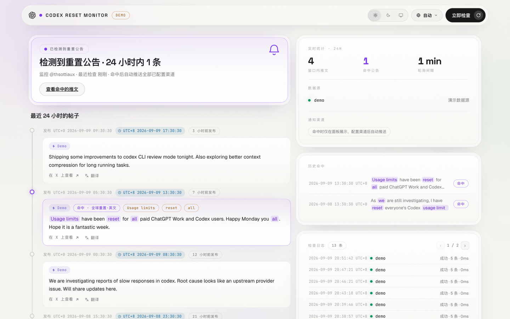

# Codex Reset Monitor (OpenAI Reset Monitoring)

[中文](README.md) | English

Watches the public posts of X (Twitter) user [@thsottiaux](https://x.com/thsottiaux) (Tibo · the person behind
OpenAI Codex) over the last 24 hours. When a "**global usage-limit reset**" announcement shows up, it raises an
alert on the dashboard and pushes notifications to Feishu / DingTalk / WeCom / Bark / Telegram.

> Background: Tibo follows a "weekly reset" cadence (e.g. *"Usage limits have been reset for all paid ChatGPT Work
> and Codex users"*). This tool tells you the moment it happens.



## Features

- ⏱ **Scheduled polling**: fetches the account timeline every 5 minutes by default (configurable), deduplicated
  by tweet ID into SQLite
- 🔀 **Dual-source failover**: twitterapi.io (third-party crawl API) and RSSHub (free) fail over automatically when
  both are configured; with only one filled, that one is used
- 🎯 **Keyword matching**: regex rules designed around Tibo's real wording (Chinese & English); matched terms are
  highlighted on the dashboard
- 🔔 **Five push channels**: Feishu / DingTalk / WeCom / Bark / Telegram; each hit pushes at most once per channel,
  failed channels are retried automatically (succeeded ones are never re-sent), duplicate announcements never disturb twice
- 🩺 **Source self-alerting**: when a data source keeps failing, all configured channels get an alert, and a recovery
  notice follows once polling is healthy again — no more silently dead monitors
- 📈 **Reset rhythm stats**: average interval, last hit and the next expected window derived from hit history,
  with a mini timeline
- 🔐 **JWT login auth**: the dashboard stays anonymously viewable (24-hour data); actions like "Check now" guide
  visitors to sign in as admin. JWT (HS256) is valid for 24 hours by default, configurable
- 📊 **Dashboard**: alert banner + 24-hour post feed on the left; live stats, sources, channels, hit history and
  check logs on the right; auto refresh every 60 seconds
- 🕐 **Timestamps at a glance**: every post shows the real publish time (UTC+0), the converted time (UTC+8) and
  "published N hours ago"; push messages carry both timezones as well
- 🔤 **One-click translation**: each post card has a "Translate" button (Google channel first, MyMemory fallback,
  both key-free); translations are cached in SQLite and survive page refreshes
- 🌓 **Light/dark theme**: dark / light / follow-system, preference remembered locally
- 🌍 **Chinese & English UI**: the dashboard language follows the browser; the push message language is configured
  independently
- 🧪 **DEMO mode**: experience the full flow locally without any credentials

## Quick start

```bash
# 1. (optional) try DEMO mode first — no configuration needed
DEMO=1 bash start-backend.sh        # Windows: start-backend.bat
# open http://127.0.0.1:8730

# 2. production: create .env and fill in credentials (the script also creates it on first run)
cp .env.example .env
# edit .env: at least one data source (see "Configuration" below), then restart:
bash start-backend.sh
```

Once started, visit `http://127.0.0.1:<port>`. The port follows `MONITOR_PORT` in `.env`
(with no configuration the built-in default is `8730`).

Notes:

- `start-backend.sh` (Windows: `start-backend.bat`) creates the virtualenv and installs backend dependencies
  automatically: it uses [uv](https://docs.astral.sh/uv/) when available (faster), otherwise falls back to
  `python3 -m venv` + pip
- The dashboard is a React single-page app: source deployments must build the frontend first (see
  "Development" below); the Docker image ships with the panel pre-built

## Production deployment

### Option 1: Docker Compose (recommended, separate frontend/backend containers)

Prerequisite: Docker and Docker Compose installed. Architecture:

```
browser ──► frontend container (Caddy: serves the React panel's static files)
                │ /api, /healthz reverse-proxied (same origin, no CORS)
                ▼
          backend container (FastAPI pure API, internal to the compose network)
```

```bash
# 1. prepare configuration
cp .env.example .env
# edit .env: fill in data source credentials, push channels; the public port is FRONTEND_PORT (default 8080)

# 2. build and start in the background
docker compose up -d --build

# 3. logs / stop
docker compose logs -f
docker compose down            # stop (data kept in ./data)
```

Then open `http://<host>:8080` (the public port defaults to 8080; change it via `FRONTEND_PORT` in `.env`).

Notes:

- Two independently built images: frontend (bun builds the React panel → Caddy serves static files and
  reverse-proxies the API), backend (uv installs deps from the lockfile → pure API service, port not published)
- Frontend-only changes: `docker compose up -d --build frontend` (the backend container stays untouched;
  layer caching keeps it to a minute or two)
- `.env` is not baked into the images; secrets are injected at runtime. SQLite data is persisted in `./data`

### Option 2: from source (no Docker)

```bash
# 1. build the frontend (required, needs bun: https://bun.sh)
cd frontend && bun install && bun run build && cd ..

# 2. start the backend
bash start-backend.sh        # Windows: start-backend.bat
```

The backend serves the panel from `frontend/dist/`; without a build, `/` returns a 503 page with build
instructions.

## Development

The frontend and backend are two separate services — during development **start each one in its own terminal**.
Requirements (the scripts fall back automatically):

- Backend: [uv](https://docs.astral.sh/uv/) or Python ≥ 3.9, either one
- Frontend: [bun](https://bun.sh) or Node.js, either one

### 1. Start the backend

```bash
bash start-backend.sh        # macOS / Linux
start-backend.bat            # Windows
```

The script creates the virtualenv, installs dependencies and starts the server (picks uv or classic pip
automatically). You can also do the same steps manually:

```bash
# create the virtualenv and install dependencies (either way)
uv venv && uv pip install -r requirements.txt                      # with uv
python3 -m venv .venv && .venv/bin/pip install -r requirements.txt # classic pip (Windows: .venv\Scripts\)

# start the backend (reads .env: port MONITOR_PORT, sample config 8730)
.venv/bin/python -m app.main
```

### 2. Start the frontend

```bash
cd frontend
bun install     # first time
bun dev         # dev server: http://localhost:5173 (hot reload on frontend/src changes)
```

`/api` and `/healthz` requests are proxied to the local backend on 8730 (proxy target lives in
`frontend/vite.config.ts` — sync it if you change the backend port); no CORS to worry about.

### Quality checks

```bash
bash check.sh                        # backend: ruff lint + format + mypy types (must be green before any delivery)
cd frontend && bun run lint          # frontend: oxlint
cd frontend && bun run build         # frontend: type check + build
```

Frontend changes must be verified in the browser (rendering OK, console clean) before delivery.

## Reading the dashboard

- **Top banner**: normally "Monitoring · last check N minutes ago"; when a reset announcement hits it turns into a
  red alert with a direct link
- **Last 24 hours posts**: each post carries three time labels —
  `Published UTC+0` (the real publish time, also the raw time from the X API),
  `UTC+8` (converted, same as what you see on X),
  `published N hours ago` (updated on every refresh).
  Hit posts carry a purple "hit" badge with the matched terms highlighted
- **Post translation**: click "Translate" under a card to expand the machine translation (click again to collapse);
  translations are cached per tweet permanently, only the first click really calls the translation API; the button is
  hidden for English posts while the UI language is English
- **Live stats**: tweets in window, hit announcements, polling interval
- **Sources / channels**: each source shows "healthy / failed · N minutes ago"; channels show readiness
- **Hit history**: every hit ever (not limited to the 24-hour window), up to two lines of content, click a row to
  open the original tweet
- **Check logs**: one entry per poll (time, source, success/failure, new tweets, latency), kept for 30 days, paginated
- **Top-right buttons**: login badge (shown when auth is enabled; a lock icon when anonymous, a green dot + username
  when signed in — click to manage/logout), theme switcher, check now; "Send test notification" only appears with
  `MONITOR_ENV=debug` (see below)

## Configuration

All configuration is done through the `.env` file at the project root (or system environment variables).
Priority: **system environment variables > `.env` file > built-in defaults**.
Core convention: **a source or channel is enabled once its credentials are filled, and disabled when left empty**.
How to obtain every item is documented in the comments of `.env.example`.

| Env var | Default | Description |
|---|---|---|
| `MONITOR_ENV` | `production` | with `debug` the dashboard shows the "Send test notification" button and serves `/docs`, `/redoc`, `/openapi.json` API docs |
| `DEMO` | empty | set to `1` to run on built-in demo data |
| `MONITOR_SITE_NAME` | `Codex Reset Monitor` | dashboard name (browser tab title + navbar) |
| `MONITOR_HOST` / `MONITOR_PORT` | `127.0.0.1` / `8730` | dashboard listen address (the sample config uses `0.0.0.0:8730`) |
| `MONITOR_ACCOUNTS` | `thsottiaux` | X accounts to watch, comma separated, without @ |
| `MONITOR_POLL_INTERVAL` | `5` | polling interval (minutes) |
| `MONITOR_LOOKBACK_HOURS` | `24` | dashboard & alert window (hours) |
| `MONITOR_INCLUDE_REPLIES` | `true` | also watch replies (announcements sometimes arrive as replies); RSSHub cannot detect replies, so the badge only exists for twitterapi.io |
| `TWITTERAPI_IO_KEY` | empty | twitterapi.io API key; empty disables the source |
| `RSSHUB_BASE_URL` | empty | RSSHub instance URL; empty disables the source |
| `RSSHUB_ROUTE` | `twitter/user` | RSSHub route |
| `RSSHUB_ACCESS_KEY` | empty | fill with the same value when the RSSHub instance enables `ACCESS_KEY` auth |
| `FEISHU_WEBHOOK` | empty | Feishu group bot webhook |
| `DINGTALK_WEBHOOK` | empty | DingTalk group bot webhook |
| `WECOM_WEBHOOK` | empty | WeCom group bot webhook |
| `BARK_URL` | empty | Bark push URL (https://api.day.app/yourKey) |
| `TG_BOT_TOKEN` / `TG_CHAT_ID` | empty | Telegram bot credentials (both required to enable) |
| `MONITOR_NOTIFY_LANG` | `zh` | push message language: `zh` / `en` (the dashboard language follows the browser, independent of this) |
| `MONITOR_ADMIN_USER` | `admin` | admin login username |
| `MONITOR_ADMIN_PASSWORD` | empty | admin password; when set, actions like "Check now" require login (JWT) while viewing stays public; empty disables auth |
| `MONITOR_JWT_SECRET` | empty | JWT signing secret; when empty, a stable secret is derived from the admin password (rotating the password invalidates all tokens) |
| `MONITOR_TOKEN_EXPIRE_HOURS` | `24` | login session lifetime (hours) |
| `MONITOR_PUBLIC_URL` | empty | optional public URL; when set, source alerts include a panel link |
| `MONITOR_SOURCE_ALERT_THRESHOLD` | `3` | source self-alert: alert all channels after this many consecutive fully-failed cycles (`0` disables) |
| `MONITOR_SOURCE_ALERT_REPEAT_MINUTES` | `60` | minutes between repeat alerts while still down (`0` never repeats) |
| `MONITOR_TWEET_RETENTION_DAYS` | `30` | retention days for non-hit posts (rolling cleanup) |
| `MONITOR_HIT_RETENTION_DAYS` | `180` | retention days for hit posts (feeds the reset rhythm stats) |
| `MONITOR_RULES_JSON` | built-in rules | optional JSON array overriding the match rules |

### Sources (pick one; both configured = automatic failover)

**Option 1: twitterapi.io (recommended)**

1. Sign up at [twitterapi.io](https://twitterapi.io), top up and create an API key
2. Fill `TWITTERAPI_IO_KEY=yourKey` in `.env`
3. Cost: pay per use; incremental polling (1~2 pages ≈ 20–40 tweets per 5 minutes, 2 pages with reply watching
   enabled) costs a few dollars a month — see the official site for pricing

**Option 2: RSSHub (free)**

Twitter routes need an RSSHub instance with an X login session; public instances are basically unusable,
so self-host one:

```bash
# Log into x.com in the browser → F12 → Application → Cookies, copy the auth_token value
# (ct0 is not needed — the newer RSSHub fetches it automatically at runtime)
docker run -d --name rsshub -p 1200:1200 \
  -e TWITTER_AUTH_TOKEN=your_auth_token diygod/rsshub
# Recommended: enable auth on the instance by adding -e ACCESS_KEY=random_secret;
# both verification and monitoring requests then carry ?key=secret
# After http://127.0.0.1:1200/twitter/user/thsottiaux?key=secret returns XML,
# fill RSSHUB_BASE_URL and RSSHUB_ACCESS_KEY in .env
```

> Note: an expired cookie makes RSSHub fail silently; the source shows "failed" on the dashboard — just replace the
> token then. With both sources configured, a failing one automatically switches to the other.

### Push channels (multiple allowed)

| Channel | Credentials | How to obtain |
|---|---|---|
| Feishu | `FEISHU_WEBHOOK` | Group settings → Group bot → Add "custom bot" |
| DingTalk | `DINGTALK_WEBHOOK` | Group bot; if the "custom keyword" security setting is enabled, use `Codex重置监控` (push titles carry the `【Codex重置监控】` prefix) |
| WeCom | `WECOM_WEBHOOK` | Right-click the group → Add group bot |
| Bark (iOS) | `BARK_URL` | Install Bark from the App Store, fill `https://api.day.app/yourKey` |
| Telegram | `TG_BOT_TOKEN` + `TG_CHAT_ID` | Create a bot with @BotFather; get your chat_id from @userinfobot |

**How to verify the setup**: set `MONITOR_ENV=debug` in `.env` and restart — the "Send test notification" button
appears in the top-right of the dashboard; click it and every configured channel receives a test message. Switch back
to `production` afterwards (the button hides again; normal pushing is unaffected).

**A push looks like this** (language set by `MONITOR_NOTIFY_LANG`, English shown):

```
🚨 Codex Reset Monitor Hit
Account: @thsottiaux
Matched rule: 全球重置·英文
Published: 2026-09-09 05:34:46 (UTC+0)
Published: 2026-09-09 13:34:46 (UTC+8)

Content:
Usage limits have been reset for all paid ChatGPT Work and Codex users. …

Open tweet:
https://x.com/thsottiaux/status/…
```

> The matched-rule name comes from your rule configuration; the built-in rule names are Chinese —
> override them with `MONITOR_RULES_JSON` if you want English names.

### Match rules

Five built-in rules (see `DEFAULT_RULES` in `app/core/config.py`). Logic: **within one rule, every keyword must
match (case-insensitive) for a hit**.

- **English reset**: `reset` ∧ `usage/rate limits` ∧ (`paid`/`everyone`/`all`/`codex`…) — covers
  *"Usage limits have been reset for all paid…"*, *"I have reset everyone's Codex usage limits"*, etc.
- **Chinese reset**: `重置` ∧ (`用量`/`限额`/`额度`/`付费`/`订阅`/`全球`) — fallback
- **Broad English reset**: `reset` ∧ (`usage/rate limits` ∨ `a reset`) — catches heads-up posts like
  *"I will reset usage limits this evening"* as well as announcements without the word "limits" such as
  *"a reset is also landing by midnight today"* (the article constraint avoids "factory reset" false positives)
- **Subscription pause (EN)**: `pause/suspend/halt/stop/close/on hold/no longer` ∧ (`subscription`/`sign-up`) —
  covers *"we're pausing subscriptions to our $200 Pro plan"*
- **Subscription resume (EN)**: `reopen/resume/unpause/back/again` ∧ (`subscription`/`sign-up`/`pro`) —
  covers *"Pro subscriptions are back"* (action verbs deliberately broad: a false positive costs one push,
  a miss costs you the recovery)

To fix false positives/negatives, override with the `MONITOR_RULES_JSON` env var (JSON array, same structure as
built-ins; invalid JSON falls back to the built-ins with a log line). To watch other accounts (e.g. @sama,
@OpenAI), set `MONITOR_ACCOUNTS` to a comma-separated list.

## API

| Endpoint | Description |
|---|---|
| `GET /` | dashboard |
| `GET /api/status` | overall status (hits, source health, channels, rules) |
| `GET /api/tweets?hours=24` | posts within the time window |
| `GET /api/hits` | hit history |
| `GET /api/polls` | check logs |
| `GET /api/stats` | reset rhythm stats (avg interval / last hit / expected window) |
| `GET /api/translate?id=…&to=zh` | translate a post (login required; `to` supports `zh` / `en`, cached in SQLite) |
| `POST /api/login` | admin login, issues a JWT |
| `POST /api/poll-now` | trigger a check immediately (login required) |
| `POST /api/test-notify` | send a test message to all configured channels (login required) |
| `GET /healthz` | health check |

With `MONITOR_ADMIN_PASSWORD` set, `POST /api/poll-now`, `POST /api/test-notify` and `/api/translate` require
login first: exchange credentials for a JWT via `POST /api/login`, then send `Authorization: Bearer <token>`.
Read endpoints and the dashboard stay public; anonymous `/api/tweets` is clamped to a 24-hour window.
All `/api/*` responses share the envelope `{code, data, message}` (`code=200` on success); errors use
`{code, message, errors}` with the HTTP status matching `code`. `/healthz` is the exception and returns
`{"ok": true}` verbatim. Responses are Pydantic models; `/docs` (plus `/redoc` and `/openapi.json`) exposes the
OpenAPI schema and is available only with `MONITOR_ENV=debug` — production does not register those paths.

## Behavior details

- **Window & alerts**: the dashboard shows the last 24 hours (`MONITOR_LOOKBACK_HOURS` configurable); only
  "freshly stored and in-window" hits trigger pushes — backfilled historical hits are stored without pushing,
  so old news never wakes you in the middle of the night
- **Startup rescan**: on every start, the last 30 days of posts are re-checked with the current rules and hit
  records are backfilled (rule changes heal history); missed announcements published within 24 hours that were
  never pushed get pushed, older ones only get their records backfilled
- **No duplicate noise**: the same announcement posted as several tweets (highly similar content) pushes only the
  first one
- **Latency**: the default poll interval is 5 minutes. Reset announcements usually land hours before they take
  effect, so 5 minutes is enough; lowering it gets you there sooner and costs more per fetch
- **Self-alerting**: after `MONITOR_SOURCE_ALERT_THRESHOLD` (default 3) consecutive fully-failed cycles, all
  configured channels receive an alert, followed by a recovery notice once healthy; alert state is persisted, so
  restarts neither re-spam nor miss the recovery. Having no source configured doesn't count as failure, and DEMO
  mode neither alerts nor really pushes
- **Access auth**: empty `MONITOR_ADMIN_PASSWORD` disables auth entirely; when set, the dashboard stays anonymously
  viewable (anonymous `/api/tweets` clamped to 24h) while check-now / test-notify / translate require login
  (JWT valid 24h by default; the signing secret is derived from the password unless configured explicitly)
- **Retention**: non-hit posts are pruned after 30 days while hits are kept 180 days (feeding the reset rhythm
  stats; both configurable); check logs are kept for 30 days

## Running as a resident service (optional)

```bash
# Option 1: nohup in the background
nohup bash start-backend.sh > reset-monitor.log 2>&1 &

# Option 2: launchd (autostart on macOS)
# create ~/Library/LaunchAgents/com.openai_reset_monitoring.plist and adjust as needed:
```

```xml
<?xml version="1.0" encoding="UTF-8"?>
<!DOCTYPE plist PUBLIC "-//Apple//DTD PLIST 1.0//EN" "http://www.apple.com/DTDs/PropertyList-1.0.dtd">
<plist version="1.0"><dict>
  <key>Label</key><string>com.openai_reset_monitoring</string>
  <key>ProgramArguments</key><array>
    <string>/bin/bash</string><string>-c</string>
    <string>cd /path/to/OpenAI-Reset-Monitoring &amp;&amp; bash start-backend.sh</string>
  </array>
  <key>RunAtLoad</key><true/>
  <key>KeepAlive</key><true/>
  <key>EnvironmentVariables</key><dict>
    <key>TWITTERAPI_IO_KEY</key><string>yourKey</string>
  </dict>
</dict></plist>
```

```bash
launchctl load ~/Library/LaunchAgents/com.openai_reset_monitoring.plist
```

## Project structure

```
frontend/             # standalone React frontend (Vite + React 19 + TS, bun, react-i18next + React Bits)
├── src/api/          # API layer: unified envelope / JWT session / backend response types
├── src/components/   # Nav / Footer / LoginDialog + React Bits animation components (CountUp / AnimatedContent)
├── src/context/      # Auth / Theme / Toast cross-cutting state
├── src/features/     # business areas: hero / feed / sidebar
├── src/i18n/         # i18next setup + locales/{zh,en}.ts
├── src/styles/       # panel.css (shared full stylesheet)
├── Caddyfile         # production entry: static hosting + /api reverse proxy to the backend container (SPA fallback, caching)
├── Dockerfile        # frontend image: bun build → Caddy hosting
└── public/assets/    # favicons (light & dark) / logos / apple-touch-icon

app/
├── main.py            # entry point: app assembly + dashboard page; /api/* routes split by domain under api/
├── api/               # routing layer: auth / status / tweets / polls / stats / translate / system (health check, test notify)
├── core/              # cross-cutting basics
│   ├── config.py      # configuration loading (.env / environment variables) + built-in match rules
│   ├── errors.py      # unified exception handling: exceptions to same-status-code bodies
│   ├── security.py    # JWT login auth (issue / verify / protecting dependency)
│   ├── timeutil.py    # time parsing / UTC formatting
│   └── text.py        # text normalization / similarity / content fingerprint
├── schemas/           # response models: per-endpoint DTOs and the unified /api/* envelope
├── models/            # ORM models (table & column names identical to the legacy schema)
├── repositories/      # data access: tweets / polls / source health / notify log / translation cache
├── db/
│   └── database.py    # SQLite async engine / sessions / table creation & defensive migrations
├── services/          # business layer: poll scheduling / matching / status aggregation / queries / translation / test notify / source watch
│   ├── matcher.py     # keyword match rules
│   ├── poller.py      # polling scheduler: fetch → dedup → match → push
│   ├── source_watch.py# source self-alerting: channel alerts on repeated failures, recovery notice
│   └── stats.py       # reset rhythm stats (/api/stats)
├── integrations/      # external system adapters
│   ├── translate.py   # translation upstream API client (Google / MyMemory)
│   ├── sources/       # source adapters: twitterapi_io / rsshub / demo + automatic failover
│   └── notifiers/     # channels: feishu / dingtalk / wecom / bark / telegram
```

Frontend-specific details (directory responsibilities, i18n and React Bits conventions) live in
[frontend/README.md](frontend/README.md).

## License

Released under the [MIT License](LICENSE).
